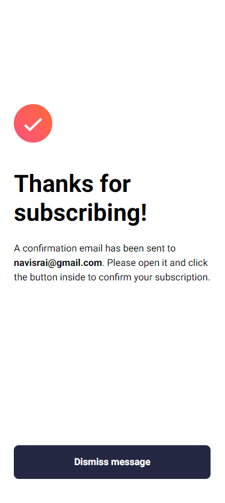

# Frontend Mentor - Newsletter sign-up form with success message solution

This is a solution to the [Newsletter sign-up form with success message challenge on Frontend Mentor](https://www.frontendmentor.io/challenges/newsletter-signup-form-with-success-message-3FC1AZbNrv). Frontend Mentor challenges help you improve your coding skills by building realistic projects. 

## Table of contents

- [Overview](#overview)
  - [The challenge](#the-challenge)
  - [Screenshot](#screenshot)
  - [Links](#links)
- [My process](#my-process)
  - [Built with](#built-with)
  - [What I learned](#what-i-learned)
  - [Continued development](#continued-development)
  - [Useful resources](#useful-resources)
- [Author](#author)

## Overview

### The challenge

Users should be able to:

- Add their email and submit the form
- See a success message with their email after successfully submitting the form
- See form validation messages if:
  - The field is left empty
  - The email address is not formatted correctly
- View the optimal layout for the interface depending on their device's screen size
- See hover and focus states for all interactive elements on the page

### Screenshot




### Links

- Solution URL: [Github Repo](https://github.com/rainSax/interactive-signup-page-with-success-message)
- Live Site URL: [Live site](https://rainsax.github.io/interactive-signup-page-with-success-message/)

## My process

### Built with

- Semantic HTML5 markup
- CSS custom properties
- Flexbox
- Javascript

### What I learned

This project gave me a lot of practice in html, css, and js, and after completing a few newbie ones I decided to take this one on, my first Junior level project. The main thing I learned were having to do with how to write the javascript code. I found out that using regular expressions is a common way to handle email validation.

```js
var validRegex = /^\w+([\.-]?\w+)*@\w+([\.-]?\w+)*(\.\w{2,3})+$/;
    if (suggestion.match(validRegex)) {
        email = suggestion;
        console.log(email);
        document.querySelector("#inputtedemail").textContent = email;
        document.querySelector("#inputtedemail").style.fontWeight = 700;
        return 1;
}
```

### Continued development

For continued development I would align the writing in the email text box to line up with the placeholder text. right now it's a few spaces behind. Getting this to work might require refactoring the email validation function but it shouldnt be too hard.

### Useful resources

- [Replace an image](https://stackoverflow.com/questions/2182716/is-it-possible-to-set-a-src-attribute-of-an-img-tag-in-css) - This post on stack overflow helped me learn a technique for changing an image. I used it when switching to mobile view.
- [Fluid typography](https://royalfig.github.io/fluid-typography-calculator/) - Very useful resource for generating clamp functions to minimize use of media queries. Can be applied to fonts but also other elements like images.

## Author

- Frontend Mentor - [@rainSax](https://www.frontendmentor.io/profile/rainSax)
